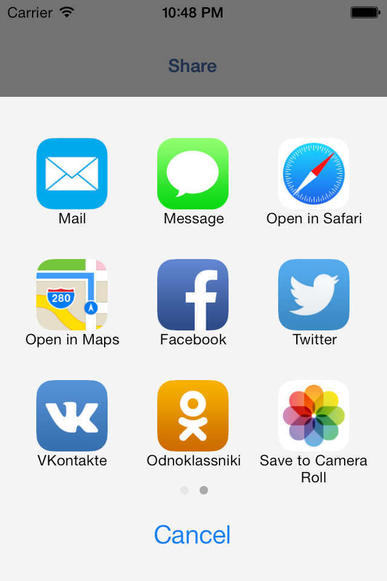

GPActivityViewController
========================

Alternative to UIActivityViewController



###Supported activities
* Facebook
* Twitter
* Vkontakte
* Odnoklassniki
* Mail
* Messages
* Copy
* Camera Roll
* Maps
* Safari


### Requirements
* Xcode 6.3+
* Deployment Target iOS7.0+
* ARC

Note: 2.0.2 — latest version with iOS5 support

### Features
* Landscape support
* Pagination
* Custom activities
* Activity customization
* ActivityViewController completion handler

### Further work
* Drop-in replacement for UIActivityViewController(use same activity)
* iOS7 look and fill
* Universal message composer
 
## Installation
The recommended way is to use [CocoaPods](http://cocoapods.org/) package manager.

To install using CocoaPods open your Podfile and add:
``` bash
pod 'GPActivityViewController', :git => 'https://github.com/gpinigin/GPActivityViewController.git'
```


##Social networks integration

For social networks listed below should be set application callback, for more info see chapter "Application callback".

###Facebook (2.0.x Only)

* Set up **FacebookAppID** property in your info.plist file, i.e.  FacebookAppID = 12345678
* Set up URL scheme for facebook redirect: fbFacebookAppID , where FacebookAppID - Facebook application ID

###Odnoklassniki

* Set up properties **OdnoklassnikiAppID**, **OdnoklassnikiSecretKey**, **OdnoklassnikiAppKey** in your info.plist file.
* Set up URL scheme for redirect: okOdnoklassnikiAppID , where OdnoklassnikiAppID - Odnoklassniki application ID

###Vkontakte

* Set up **VKontakteAppID** property in your info.plist file

## Usage
### Activity controller
``` objective-c
    // DO NOT forget to  setup application IDs in info.plist. For more info see README.md
    GPFacebookActivity *facebookActivity = [GPFacebookActivity new];
    GPTwitterActivity *twitterActivity = [GPTwitterActivity new];
    GPCopyActivity *copyActivity = [GPCopyActivity new];
    GPMailActivity *mailActivity = [GPMailActivity new];
    GPMessageActivity *messageActivity = [GPMessageActivity new];
    GPOKActivity *okActivity = [GPOKActivity new];
    GPVKActivity *vkActivity = [GPVKActivity new];
    
    NSArray *activities = @[mailActivity, messageActivity, facebookActivity, twitterActivity,
                            vkActivity, okActivity, copyActivity];
    GPActivityViewController *controller = [[GPActivityViewController alloc] initWithactivities:activities];

    controller.userInfo = @{@"text":@"Message to pass to activities",
                            @"url":[NSURL URLWithString:@"https://github.com/gpinigin"]};
    
    
    [controller presentFromBarButton:sender animated:YES];
```

### Application callbacks

To complete authentication you should register url-schemes and add application callbacks in application delegate:

``` objective-c
- (BOOL)application:(UIApplication *)application openURL:(NSURL *)url sourceApplication:(NSString *)sourceApplication
         annotation:(id)annotation {
    // For iOS 5.X only
    if ([FBSession.activeSession handleOpenURL:url]) {
        return YES;
    }

    if ([[OdnoklassnikiMgr sharedInstance] handleOpenURL:url]) {
        return YES;
    }

    if ([[VkontakteMgr sharedInstance] handleOpenURL:url]) {
        return YES;
    }

    return NO;
}
```

### Subclassing notes
``` objective-c
// Call it when activity is finished
- (void)activityFinished:(BOOL)completed;

// Should returns string that unique identifies your activity
- (NSString *)activityType;

// Override to implement your activity behavior
- (void)performActivity;
```

Note for iOS5.0: if autoorientation behavior of your controller isn't match to one of GPActivityViewController you MUST subclass GPActivityViewController to override autorotation behavior or present controller modally

### Custom activities
You also can make your custom activity using block approach:
``` objective-c
   GPActivity *myActivity = [customActivity:@"MACustomActivity" actionHandler:^(GPActivity *activity, NSDictionary *userInfo) {
        // Your code here
        //    ...
        
        // Activity is finished successfully
        [activity activityFinished:YES];
   }];
   
   myActivity.image = [UIImage imageNamed:@"myCustom"];
   myActivity.title = @"MyCustom";
```

You can also specify predefined acitivityInfo:
``` objective-c
   NSURL *url = [NSURL URLWithString:@"google.com"];
   activity.userInfo = @{@"text":@"My custom activity",
                         @"url":url};
```

##Credits
Partially based on [REActivityViewController](https://github.com/romaonthego/REActivityViewController)
